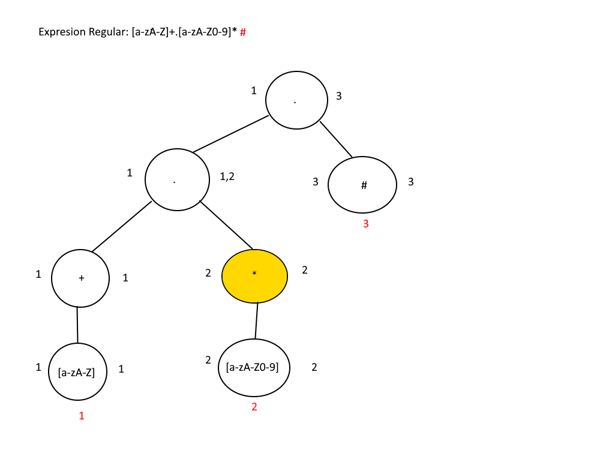

# Manual Técnico
## Obtención de lexemas
Mediante la lectura del contenido del archivo cargado al programa se lee carácter por carácter mediante un ciclo while y con la ayuda de una variable de control posición y mediante sentencia condicionales se identifica si el carácter encaja en un posible lexema como por ejemplo los string que comienzan y finalizan con comillas entonces al encontrar que un carácter sea igual a una comilla el lexema se formaría desde ese carácter hasta volver a encontrar otras comillas o hasta completar la lectura de todo el archivo originando un error.

## Verificación de lexemas
Con la ayuda de un diccionario se compara cada uno con el diccionario para verificar si este lexema es una palabra reservada de lo contrario se verifica carácter por carácter que este lexema sea válido para un identificador o string asignando el token correspondiente de lo contrario se le asigna el token "Desconocido" el cual genera un error.

## Estructura de las ventanas
Por medio de la librería Tkinter se realizó la parte visual del programa cada ventana tiene la siguiente estructura.

## Tabla de tokens
| Token | Lexema |Expresion Regular |
| ------ | ------ | ------ |
| nueva | nueva | nueva |
| CrearBD | CrearBD | CrearBD |
| EliminarBD | EliminarBD | EliminarBD |
| CrearColeccion | CrearColeccion | CrearColeccion |
| EliminarColeccion | EliminarColeccion | EliminarColeccion |
| InsertarUnico | InsertarUnico | InsertarUnico |
| ActualizarUnico | ActualizarUnico | ActualizarUnico |
| EliminarUnico | EliminarUnico | EliminarUnico |
| BuscarTodo | BuscarTodo | BuscarTodo |
| BuscarUnico | BuscarUnico | BuscarUnico |
| AperturaParentesis | ( | ( |
| CerraduraParentesis | ) | ) |
| FinSentencia | ; | ; |
| AperturaLlave | { | { |
| CerraduraLlave | } | } |
| set | $set | $set |
| DosPuntos | : | : |
| Igual | = | = |
| Coma | , | , |
| Identificador | Variable1 | [a-zA-Z]+.[a-zA-Z0-9]* |
| String | "tex1to@1" | "[[:ascii:]]+" |
| json | "{ 'hola':'adios'}" | x |

## Metodo del arbol

### Tabla siguiente
| Indice | Elemento | Siguientes |
| ------ | ------ | ------ |
| 1 | [a-zA-Z] | 1,2,3 |
| 2 | [a-zA-Z0-9] | 2,3 |
| 3 | # | - |

### Tabla de transiciones
| Posiciones | Estado | Transicion con [a-zA-Z] | Transicion con [a-zA-Z0-9] |
| ------ | ------ | ------ | ------ |
| 1,2,3 | S0 | S0 | S1 |
|2,3 | S1 | X | S1 |

### Automata finito determinista

## Gramática 
### Para L(G)={Funcion.Identificador.Igual.nueva.Funcion.AperturaParentesis.CerraduraParentesis.FinSentencia}

##### Cadenas Validas:
- CrearBD ejemplo = nueva CrearBD(); 
- EliminarBD elimina = nueva EliminarBD();
- CrearColeccion colec = nueva CrearColeccion(“NombreColeccion”);

##### Transiciones
- S -> Funcion.Identificador.Igual.nueva.Funcion.AperturaParentesis.CerraduraParentesis.FinSentencia

### Gramática Resultante
- No terminales = {S}
- Terminales = {Funcion.Identificador.Igual.nueva.Funcion.AperturaParentesis.CerraduraParentesis.FinSentencia}
- Conjunto de producciones:  S -> Funcion.Identificador.Igual.nueva.Funcion.AperturaParentesis.CerraduraParentesis.FinSentencia
- Símbolo inicial = S
