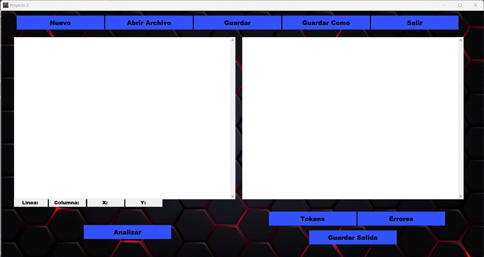
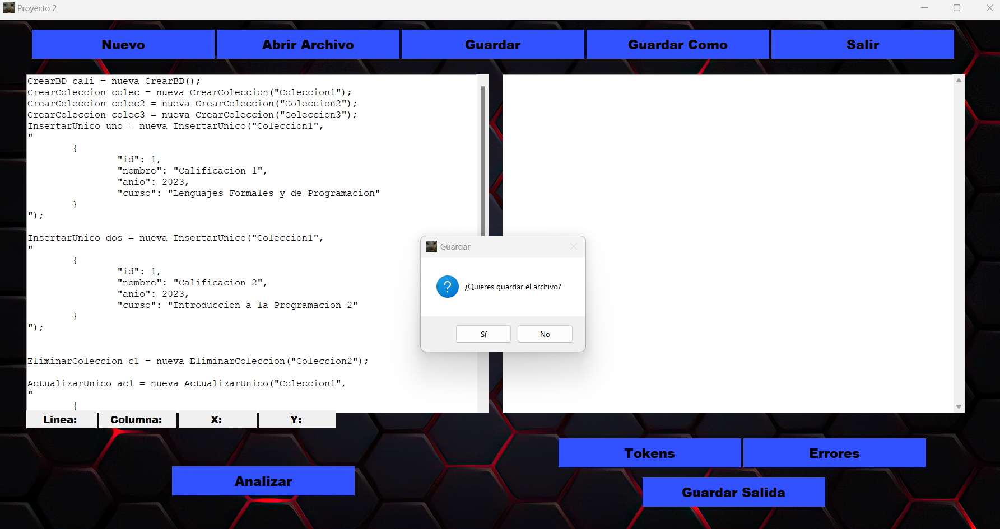
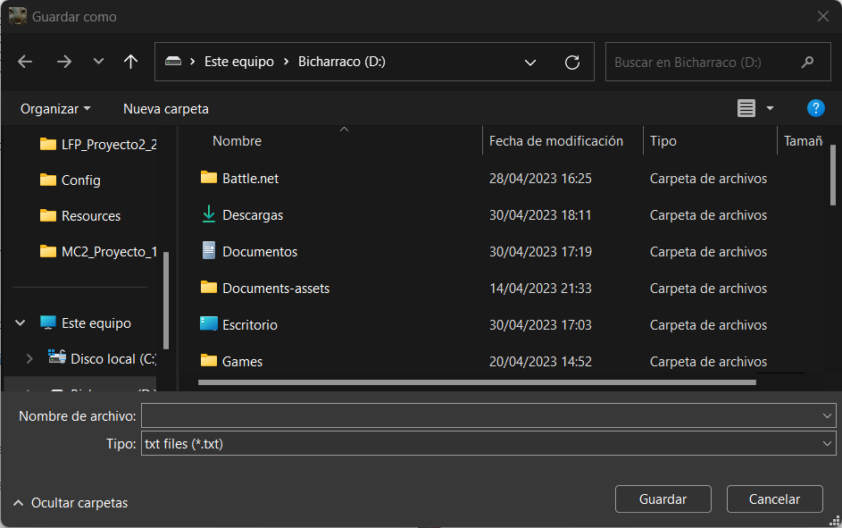
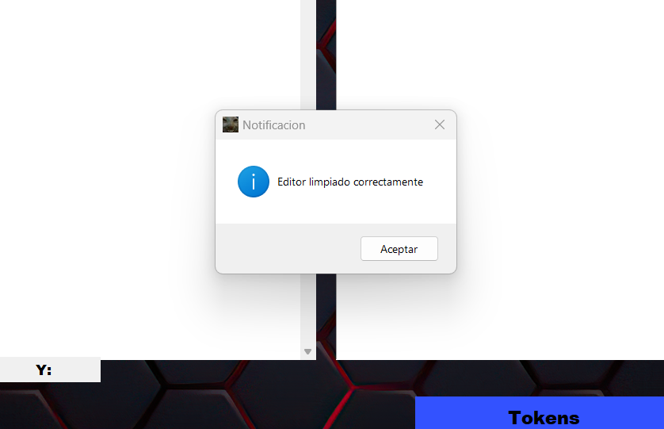
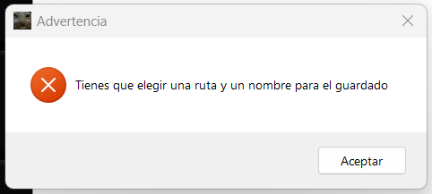
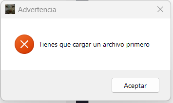
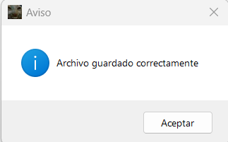
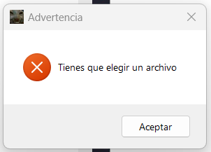
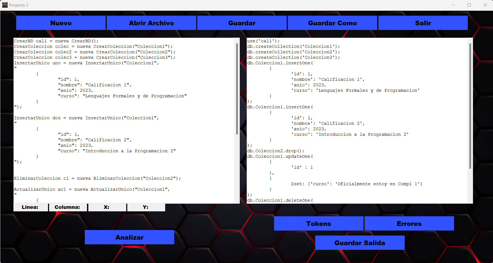
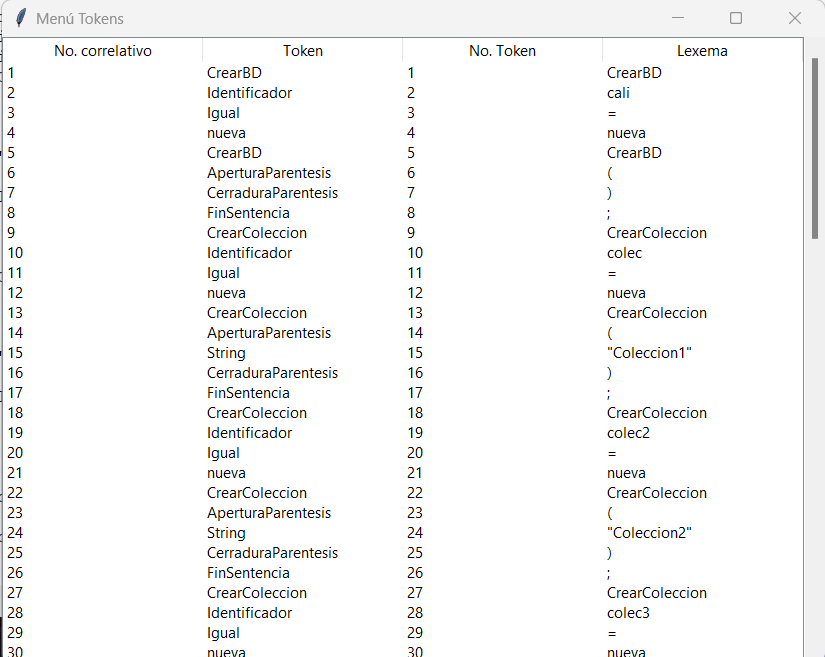

# Manual de Usuario

## A) Menú Principal
Al ejecutar el programa lo primero que se observara es la siguiente ventana:

En esta ventana lo primero que observamos son dos campos de texto, el campo de la izquierda es donde puedes ingresar texto para poder analizar después, además de que en esta área aparecerá el texto de los archivos que hayas cargado en la parte inferior de este campo observamos 4 marcadores los cuales mostraran la información de donde está el puntero dentro le campo de texto esta información se actualiza cada vez que hagas clic.

## B) Botón Nuevo
Al pulsar este botón limpias todos los datos que estén en los campos de texto y los datos que haya almacenado el programa además te preguntara si quieres guardar las sentencias que hayas ingresado en caso las haya.

Se eliges guardar los datos se te mostrará un explorador de archivos donde podrás seleccionar donde y como se guardará el archivo.

Habiendo realizado los pasos anteriores se mostrará un mensaje de confirmación y los datos ya se habrán limpiado.

## C) Botón Abrir
Esta opción te permite cargar datos desde un archivo solo debes indicar la ubicación del archivo mediante un explorador de archivos.

Si realizas todo bien el archivo se cargará de lo contrario aparecerá el siguiente mensaje:

## D) Botón Guardar
Este botón te permite guardar los cambios realizados en el editor a un archivo previamente cargado, ojo anteriormente se tuvo que cargar un archivo de lo contrario se mostrara el siguiente mensaje: 

Si todo salió bien se mostrará el siguiente mensaje:

## E) Botón Guardar Como
Al presionar este botón el contenido en el área de edición se guarda y solo debes indicar en donde y como se llamará el archivo mediante un explorador de archivos.

## F) Botón Salir
Este botón cierra el programa

## G) Botón Analizar
Este botón ejecutara el análisis de los datos del editor y mostrara la salida en el campo de la derecha.

## H) Botón Tokens
Después de analizar este botón mostrara una nueva ventana con los tokens reconocidos de la siguiente manera:

## G) Botón Errores
Después de analizar este botón mostrara una nueva ventana con los errores encontrados de la siguiente manera:

## G) Botón Guardar Salida
Después de analizar al pulsar este botón te permitirá guardar la salida es decir la traducción a MongoDB mediante un explorador de archivos.